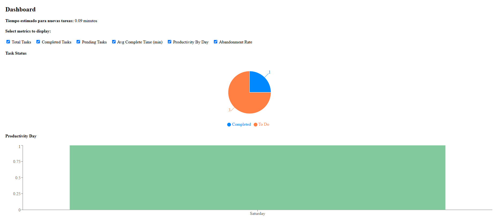
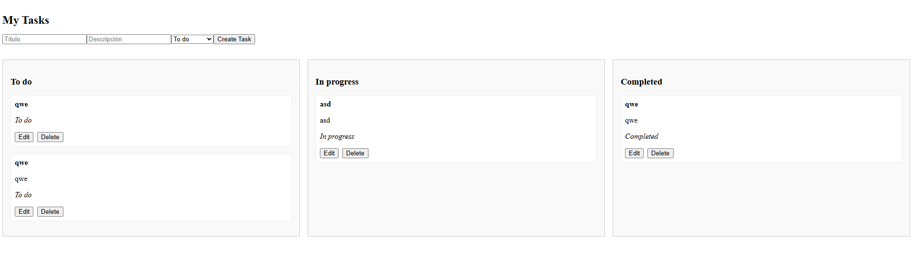

# TaskFlow – Lup App
Aplicación fullstack de gestión de tareas con dashboard analítico, autenticación segura y funcionalidades interactivas tipo Kanban.

---

## Tecnologías Usadas

| **Frontend**             | **Backend**             | **Base de Datos** |
|----------------------|---------------------|----------------|
| React.js             | Node.js + Express   | MongoDB        |
| Axios                | JWT (con Bcrypt)    | Mongoose       |
| React Router DOM     | Dotenv              |                
| @hello-pangea/dnd    |                                     
| Recharts             |                                 


---

## Funcionalidades

### Autenticación
- Registro e inicio de sesión con validación.
- Protecciones por token y expiración automática.
- Logout y navegación segura.

### Gestión de Tareas
- Crear, editar, eliminar tareas.
- Drag & drop estilo Kanban: “To Do”, “In Progress”, “Completed”.
- Persistencia en base de datos MongoDB.

### Dashboard Analítico
- Métricas calculadas desde backend:
  - Total de tareas.
  - Porcentaje de tareas completadas vs pendientes.
  - Tiempo promedio de finalización.
  - Productividad por día (gráfico de barras).
  - Tasa de abandono (tareas eliminadas sin completar).
  - Predicción del tiempo promedio estimado para tareas nuevas.
- Visualización con gráficos (PieChart + BarChart).
- Selección dinámica de métricas a mostrar.
- Exportación de métricas en formato **JSON** y **CSV**.

---

## Vista Previa



---

## Métricas Incluidas
| **Métrica**                       | **Descripción** |
|------------------------------|-------------|
| Total de tareas              | Cuenta total de tareas creadas por el usuario. |
| Porcentaje completadas       | % de tareas terminadas vs pendientes. |
| Tiempo promedio de finalización | Calculado entre `createdAt` y `completedAt`. |
| Productividad por día        | Cuántas tareas completas por día de la semana. |
| Tasa de abandono             | % de tareas eliminadas sin haber sido completadas. |
| Tiempo estimado para nuevas tareas | Promedio de tiempos de tareas anteriores. |

## Instalación y Ejecución

### Backend
```bash
cd backend
npm install
npm run dev
```

**Crea un archivo .env con:**
- MONGO_URI=conexion_mongo
- JWT_SECRET=clave_segura

---

### Frontend
```bash
cd frontend
npm install
npm start
```
---

## Cómo Probar la App
1. Inicia la app.
2. Crea tareas en /tasks y pruébalas con drag-and-drop.
3. Navega a /dashboard desde el landing (/home) para explorar estadisticas.
4. Explora las metricas o ajusta lo que ves con los checkboxes.

---

## Justificacion de Metricas
Las métricas fueron elegidas pensando en ofrecer al usuario insights valiosos sobre su productividad y hábitos de trabajo. La predicción se basa en el promedio de tiempo entre creación y completitud, lo que da una estimación razonable y explicable sin usar modelos complejos.

---

## Estructura de Carpetas

```plaintext
lup-app/
├── backend/
│   ├── controllers/
│   │   ├── authController.js
│   │   └── taskController.js
│   ├── middleware/
│   │   └── authMiddleware.js
│   ├── models/
│   │   ├── Task.js
│   │   ├── User.js
│   │   └── DeletedTask.js
│   ├── routes/
│   │   ├── authRoutes.js
│   │   └── taskRoutes.js
│   ├── server.js
│   └── .env
├── frontend/
│   ├── public/
│   │   └── index.html
│   ├── src/
│   │   ├── pages/
│   │   │   ├── Dashboard.jsx
│   │   │   ├── LandingPage.jsx
│   │   │   ├── Login.jsx
│   │   │   ├── Register.jsx
│   │   │   └── TaskBoard.jsx
│   │   ├── services/
│   │   │   └── api.js
│   │   ├── App.jsx
│   │   └── index.js
└── README.md
```

---

## Mejores prácticas aplicadas

- Código modular y reutilizable.
- Validaciones en frontend y backend.
- Tokens JWT seguros con expiración.
- Estructura clara por carpetas.
- Componente de Dashboard interactivo y exportable.

---

## Autor
Camilo Ramirez Hernandez
Desarrollador.

---

## Conclusion
Este proyecto demuestra no solo habilidades técnicas en desarrollo frontend y backend, sino también pensamiento analítico al interpretar datos y convertirlos en información útil para los usuarios. El dashboard personalizable y exportable añade un toque profesional y diferencial.
